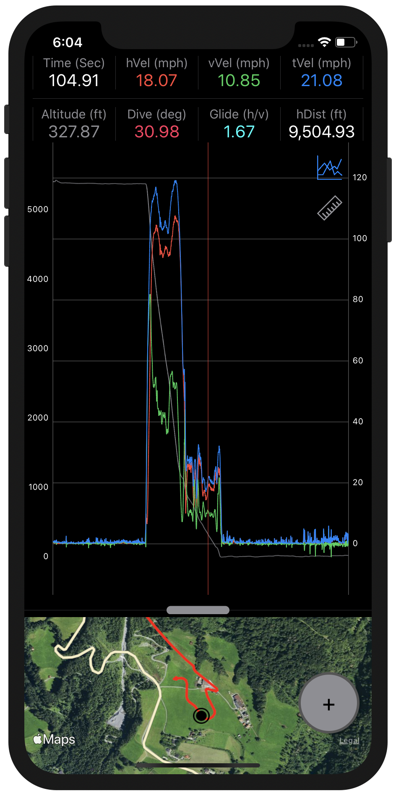
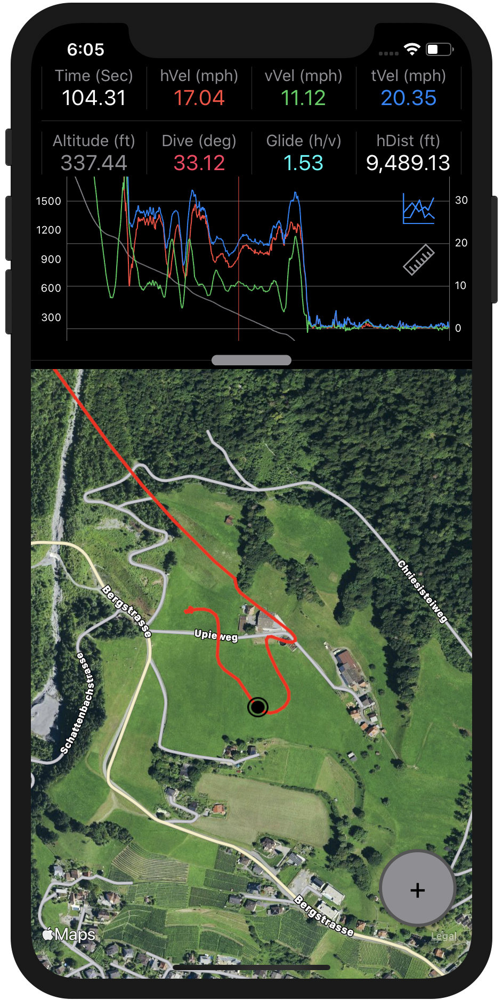
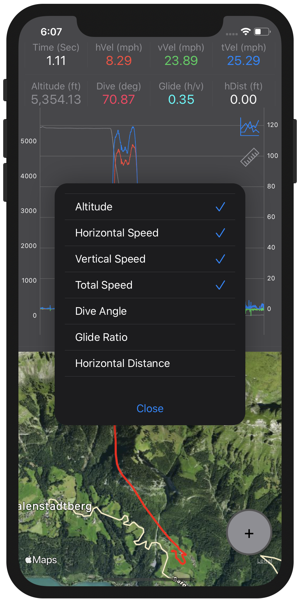
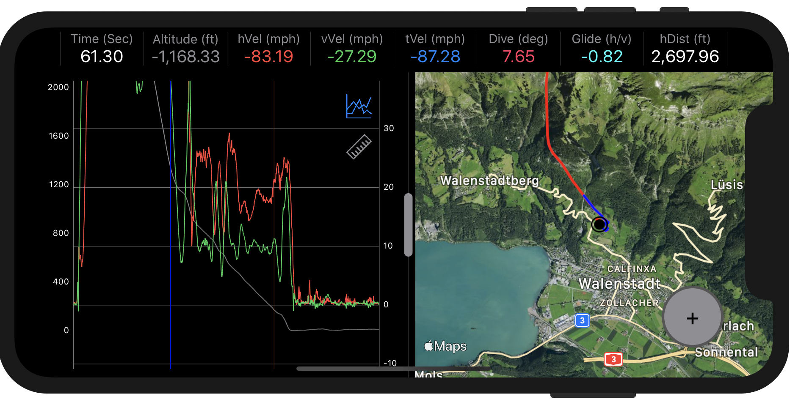

# Airtime: Infinite

First time using **Airtime: Infinite**? "Too much power" warning? Skip to [Connecting Your FlySight](#connecting-your-flysight) to get started.

**Airtime: Infinite** is an unaffiliated mobile version of [FlySight Viewer](https://github.com/flysight/flysight-viewer-qt), a tool that allows jumpers to read and analyze CSV files generated by a [FlySight](https://github.com/flysight/flysight) GPS enabled flight tracker. **Airtime: Infinite** is designed for iPhones and iPads running iOS 13+.

## Features

- Resizable data views in both landscape and portrait orientations
- **Plot View** - Multi-line chart representation of flight data
	- User selectable display data:
		- Altitiude
		- Horizontal Speed (hVel)
		- Vertical Speed (vVel)
		- Total Speed (tVel)
		- Dive Angle
		- Glide Ratio
		- Horizontal Distance (hDist)

- **Map View** - Aerial overlay of a track against terrain
- **Data Point Stat View** - Flight data at individual points on the track
- **Measurement Mode** - Determine the delta between flight stats at two user selected data points

	
	
	

 

## Connecting Your FlySight
While **Airtime: Infinite** can load files from any location on your iOS device, most users will want to pull track files directly from their FlySight via USB. In order to connect a FlySight to your iOS device, you will need to purchase a USB to Lightning adapter. We recommend the [Apple Lightning to USB 3 Camera Adapter](https://www.apple.com/shop/product/MK0W2AM/A/lightning-to-usb-3-camera-adapter).

**Note**: Non-powered adapters such as the [standard Apple Camera Adapter](https://www.apple.com/shop/product/MD821AM/A/lightning-to-usb-camera-adapter) may require your FlySight to run [custom firmware](#updating-the-flysight-firmware) and be >50% charged in order to connect to your iOS device.

To connect your FlySight to your iOS device:
1. Plug the Lightning power port on the Lightning to USB adapter into a power source. (if applicable)
	- This can be a standard [Apple Power Brick](https://www.apple.com/shop/product/MD810LL/A/apple-5w-usb-power-adapter) or a [mobile USB power bank](https://www.amazon.com/BESTON-Portable-10000mAh-Recharge-External/dp/B07MX217G9).
	- This step is only necessary if you are receiving a "Too much power" warning from iOS and do not wish to use our [custom FlySight firmware](#updating-the-flysight-firmware). Please note that even with custom firmware a non-powered adapter will likely not connect to a Flysight with <50% charge.
2. Plug the adapter into your Apple device.
3. Connect the standard FlySight USB cable from your FlySight to the USB port of the adapter.

A quickly flashing red light indicates your FlySight is sharing data with your Apple device. A solid red light or slowly flashing green light means you will need to try this procedure again before being able to access your files. Depending on your power supply, you may need to power on the FlySight in order to connect.

### "Too Much Power" Warnings
iOS devices such as iPhones and smaller iPads may present a warning like "This accessory requires too much power..." and fail to connect to the FlySight. This warning can be handled by either:
1. Ensuring that you are using an official [Apple Lightning to USB 3 Camera Adapter](https://www.apple.com/shop/product/MK0W2AM/A/lightning-to-usb-3-camera-adapter) that is connected to a reliable external power source, or
2. Upgrading your FlySight to use our custom firmware. This is the best option for a truly mobile experience. 

### Updating the FlySight Firmware
**Warning: While we have extensively tested this custom firmware, we make no guarantees of its reliability. This firmware is not officially supported by FlySight. ANY custom firmware has the potential to cause unintended issues, including irreversible damage to your FlySight and/or connected devices. We are not responsible for any loss or damages that result from installing this firmware. Use at your own risk.**

Custom FlySight firmware should only be used if you are not able to connect your FlySight to your iOS device due to power warnings and you do not wish to connect your FlySight to an external power source. This firmware should make no functional changes to the standard [FlySight firmware](https://github.com/flysight/flysight) other than allowing it to connect to most iOS devices without an external power source. Even with custom firmware an iOS device may not connect to a FlySight with <50% charge.

To update your FlySight's firmware:
1. Download the [official FlySight firmware updater](http://flysight.ca/wiki/index.php/Firmware_upgrade) onto a computer running Windows 7, macOS, or Linux. Do not install the firmware yet.
2. Extract the downloaded files.
3. Download the <a href="Firmware/flysight.hex" download>custom FlySight firmware</a>.
	- If this link does not automatically download, right click on it and select "Save Link As". Save the file as `flysight.hex`.
4. Replace the `flysight.hex` file included with the official firmware package with the custom `flysight.hex` just downloaded.
5. Follow the rest of the [instructions provided by FlySight](http://flysight.ca/wiki/index.php/Firmware_upgrade) to upgrade your device's firmware.
	- **Note**: Newer versions of macOS may throw an "Unidentified developer" error without an option to open anyway. To resolve this issue, [manually open](https://support.apple.com/guide/mac-help/open-a-mac-app-from-an-unidentified-developer-mh40616/mac) the `dfu-programmer` file once by right clicking it, selecting open, then pressing open when the "Unidentified developer" warning appears. Once done, the firmware update script can be rerun.

**Note**: FlySights using custom firmware may need to be powered on in order to connect to some iOS devices.

The custom firmware can be removed at anytime by simply following the [official FlySight firmware update guide](http://flysight.ca/wiki/index.php/Firmware_upgrade), but not replacing the `flysight.hex` file with the custom file provided above.

## Using Airtime: Infinite
1. If you haven't already, download [**Airtime: Infinite** from the AppStore](https://apps.apple.com/us/app/airtime-infinite/id1521615146) onto your iOS device.
2. [Connect your FlySight](#connecting-your-flysight)
3. Transfer your track files from your FlySight to a folder on your iOS device. (optional)
	- It is recommended that files be [copied to the iOS device](https://support.apple.com/en-us/HT206481) using the Files app prior to being loaded into **Airtime: Infinite**. Tracks loaded directly to the app from the FlySight may experience slower load times and cannot be reloaded wihout reconnecting to your FlySight if the app is closed. 
	- Files from your FlySight can be found by clicking "Browse" then selecting the FlySight device under "Locations" (e.g. "NO NAME").
4. Open **Airtime: Infinite** and press the **+** button in the bottom right corner to load a track. File system access may need to be granted at this time.
	- Tracks can be loaded from saved files stored on the iOS device using the above instructions, or directly from the FlySight itself.
5. Resize the views as desired using the draggable handle between the chart and map view.
6. Interact with the data
	- Drag/zoom the chart to update both the chart view and map view visible region.
	- Touch a point on the chart to display the flight stats at that point on the top of the screen.
	- Press the gear icon on the top right of the chart to select the data presented and modify chart settings such as scaling or measurement units.
	-  - Select the ruler icon to place the chart and data view into measurement mode. The point highlighted when measurement mode is activated is the base (represented by a blue vertical line). Tap the chart to show the difference in stats between the base and the selected point. 

## Support
Contact <jordan.gould.dev@gmail.com>

## Privacy
See our [privacy policy](PRIVACY.md).
